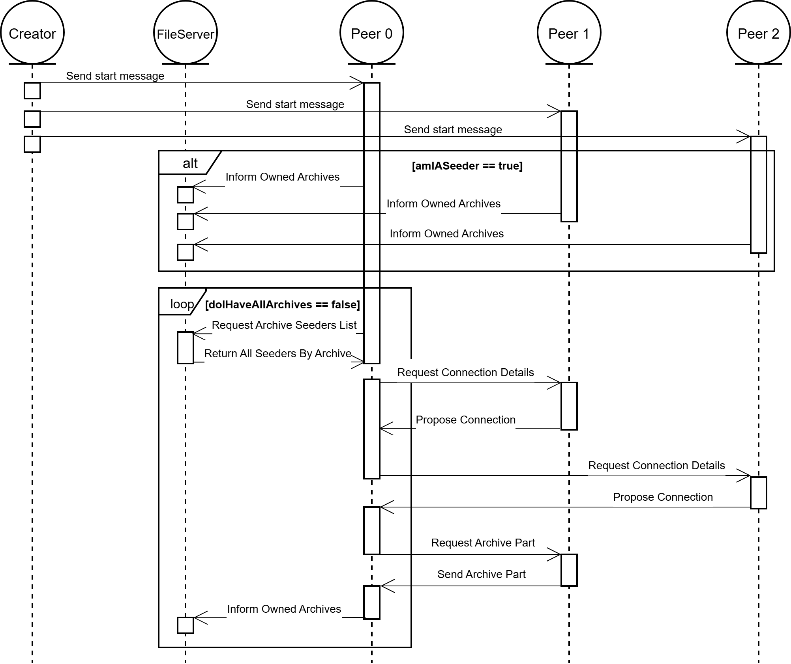
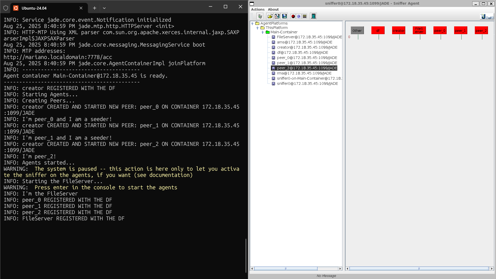
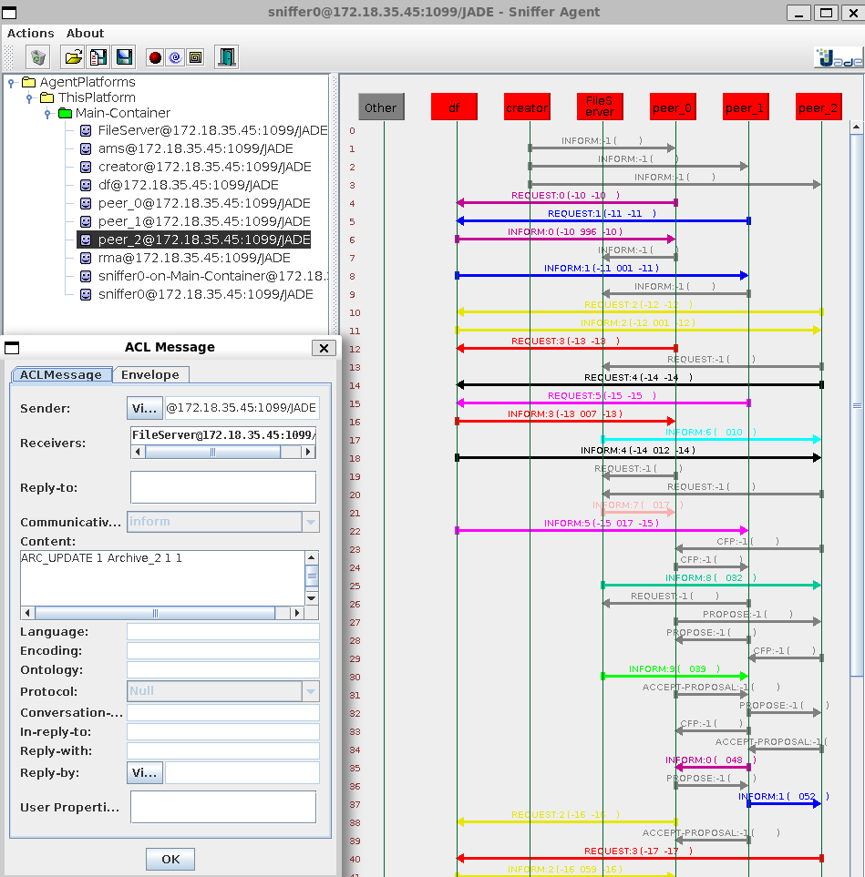
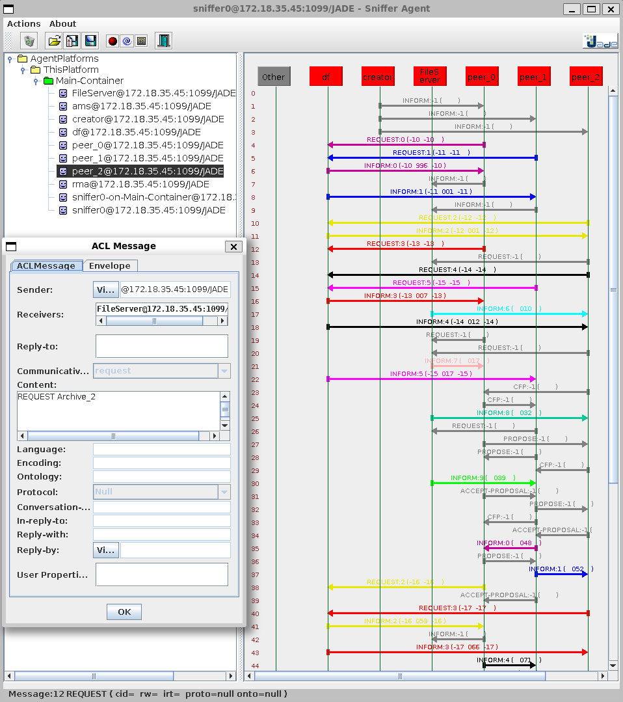
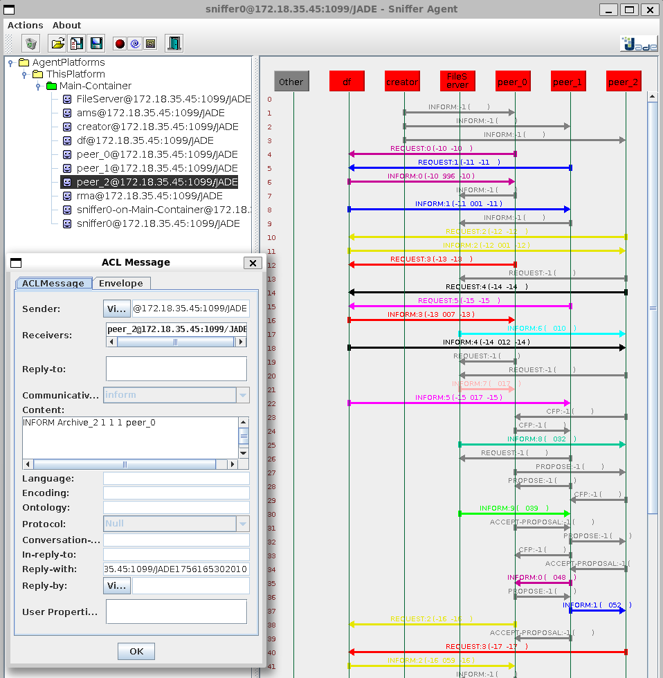
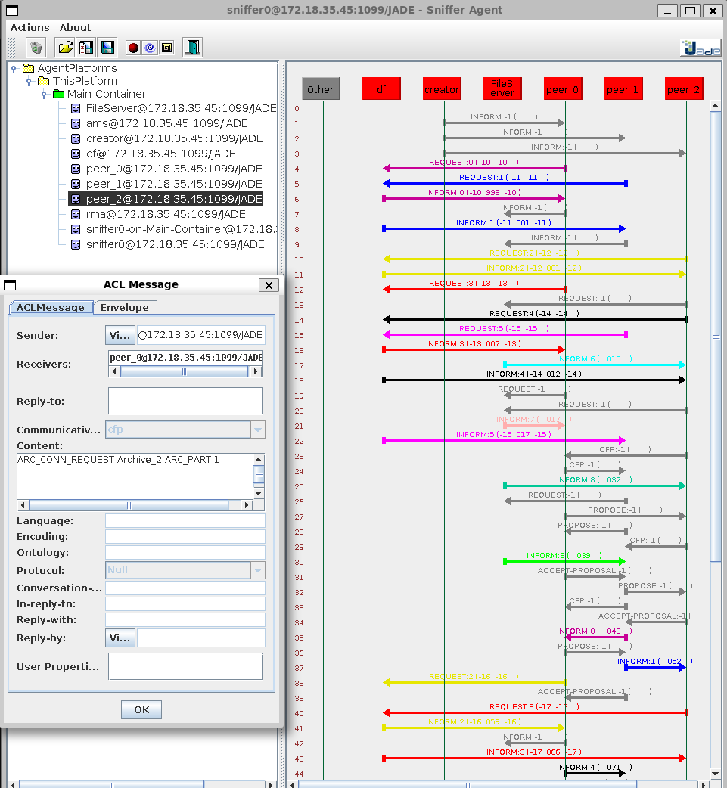
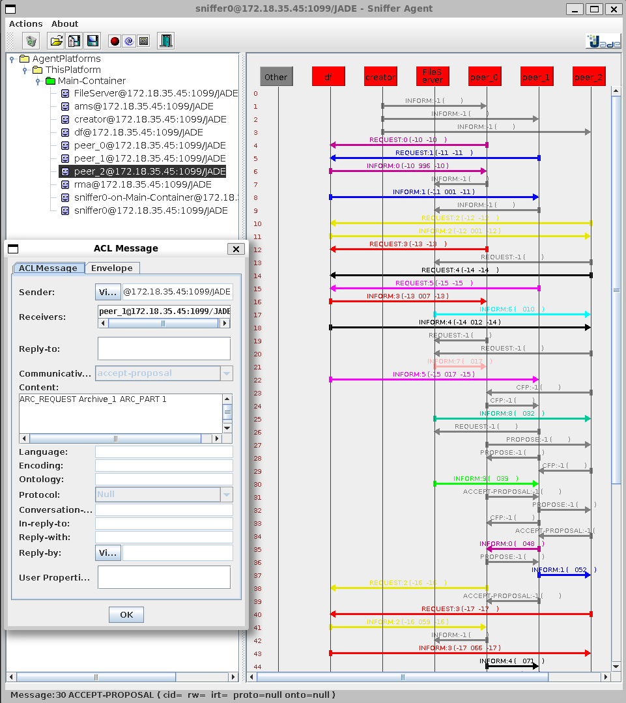
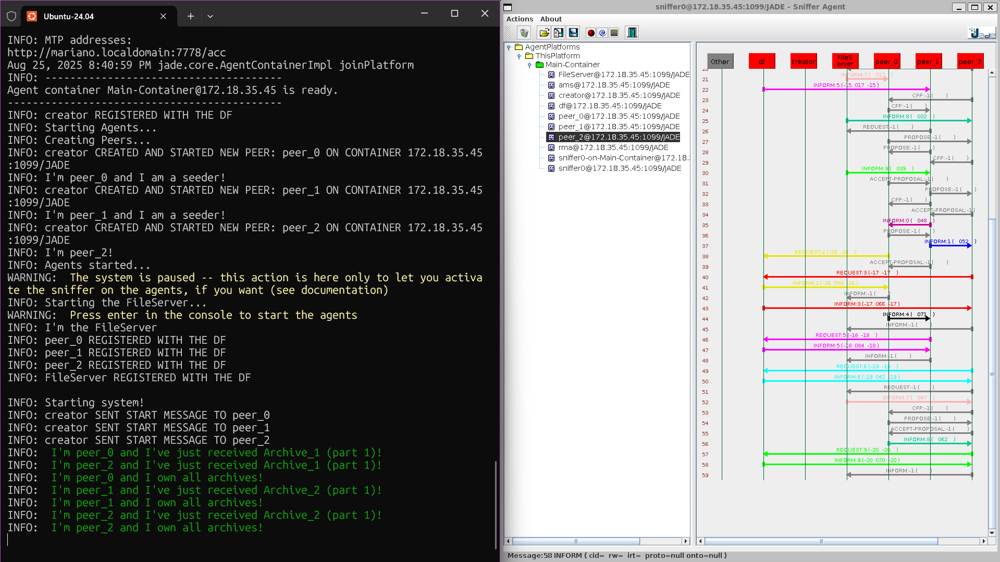

# SMA-P2P-PIBIC

Repositório voltado ao desenvolvimento do Projeto de Iniciação Científica (PIBIC) no período 2024-2025.

## Autores

| **Identificação** | **Nome** | **Formação** |
| :-: | :-: | :-: |
|  | André Corrêa da Silva | Graduando em Engenharia de Software (FCTE/UnB) |
|  | Gabriel Mariano da Silva | Engenheiro de Software (FCTE/UnB) |

*Tabela 1: Identificação dos Autores*

## Métricas do *Building Block*

[](https://sonarcloud.io/summary/new_code?id=sma-p2p-pibic-andre-gabriel_p2p-recommendation)
[](https://sonarcloud.io/summary/new_code?id=sma-p2p-pibic-andre-gabriel_p2p-recommendation)
[](https://sonarcloud.io/summary/new_code?id=sma-p2p-pibic-andre-gabriel_p2p-recommendation)

[](https://sonarcloud.io/summary/new_code?id=sma-p2p-pibic-andre-gabriel_p2p-recommendation)
[](https://sonarcloud.io/summary/new_code?id=sma-p2p-pibic-andre-gabriel_p2p-recommendation)
[](https://sonarcloud.io/summary/new_code?id=sma-p2p-pibic-andre-gabriel_p2p-recommendation)

[](https://sonarcloud.io/summary/new_code?id=sma-p2p-pibic-andre-gabriel_p2p-recommendation)

## Descrição

Este projeto visa implementar um cenário de troca de informações (representadas simbolicamente por "arquivos") entre agentes. Para tal, visou-se seguir princípios estabelecidos no protocolo de comunicação *peer-to-peer* e realizar uma abstração do cenário proposto de acordo com o estabelecido no Paradigma de Sistemas Multiagentes. Para além disso, este projeto teve como principal objetivo a implementação de critérios de recomendação em um Sistema Multiagente com comunicação *peer-to-peer*. Há, nesse projeto, três agentes principais, que compõem o universo desenvolvido no mesmo: o agente **Creator**, responsável por instanciar todos os outros agentes e iniciar a execução efetiva da lógica implementada; o agente **Peer**, representando os agentes interessados em obter todos os arquivos listados em um referencial, para além de, quando possível, fornecer arquivos para os *peers* que os demandam; e o agente **FileServer**, responsável por listar todos os *peers* com as devidas partes dos arquivos que estes podem deter.

## Diagramação

Abaixo, é apresentado o Diagrama de Classes que visa representar a estrutura e organização das classes que compõem o sistema, para além das relações entre estas.


*Figura 1: Diagrama de Classes da Aplicação*

Já abaixo, é apresentado o Diagrama de Sequência, o qual busca apresentar os fluxos de interação e algumas de suas nuances entre todas as classes (instanciadas enquanto agentes) da aplicação desenvolvida.



*Figura 2: Diagrama de Sequência da Aplicação*

## Projeto em Execução

Abaixo, na *Figura 3*, são apresentados os agentes instanciados ao início da execução do sistema, visualizados através do *sniffer* do *JADE*:



*Figura 3: Visuaização dos Agentes pelo Sniffer*

Já abaixo, na *Figura 4*, é apresentada uma visualização da mensagem enviada por um *peer* ao *FileServer* solicitando o registro das partes de arquivo que este possui:



*Figura 4: Visualização da Mensagem de Solicitação de Update da Listagem de Arquivos*

Na *Figura 5*, é apresentada a mensagem enviada por um *peer* solicitando ao *FileServer* uma listagem de todos os *peers* que possuem partes do arquivo em questão:



*Figura 5: Visualização da Mensagem de Solicitação da Listagem de Peers com o Arquivo em Questão*

Na *Figura 6*, é apresentada a mensagem enviada pelo *FileServer* ao *peer* informando os agentes que possuem determinada parte de um arquivo:



*Figura 6: Visualização da Mensagem Informando a Listagem de Peers por Parte do Arquivo*

Na *Figura 7*, é apresentada a mensagem de solicitação de conexão de um *peer* ao outro com o arquivo e a respectiva parte solicitada:



*Figura 7: Visualização da Mensagem de um Peer Solicitando Conexão a Outro*

Na *Figura 8*, é apresentada a mensagem enviada de um *peer* ao outro solicitando a determinada parte de um arquivo:



*Figura 8: Visualização da Mensagem de um Peer Solicitando um Arquivo ao Outro*

Na *Figura 9*, é apresentada a visualização do *console* ao lado do *sniffer* com o resultado final da execução do sistema:



*Figura 9: Visualização do Resultado Final da Execução do Sistema*

## Requisitos Técnicos

1. **Posse de Arquivos:** os agentes *peers* devem ser capazes de alocar para si mesmos arquivos (inicialmente representados de forma teórica), sejam eles completos ou fragmentados;
2. **Listagem de Arquivos:** o sistema deve prover uma estrutura que indique a posse integral ou parcial de arquivos pelos agentes *peers*;
3. **Solicitação de Arquivos:** a partir da listagem de posse de arquivos, um agente *peer* deve ser capaz de solicitar a outro um arquivo (parcial ou integral). A escolha do agente ao qual a solicitação será feita deve considerar critérios que indiquem características básicas de transmissão de conteúdo;
4. **Envio de Arquivos:** mediante solicitação de um outro *peer*, um agente *peer* deve ser capaz de enviar os arquivos em sua posse ao requerente;
5. **Análise de Reputação:** o requerente deve avaliar a qualidade momentânea da conexão com os *seeders* permitindo uma escolha direcionada da melhor fonte.

## Requisitos para Execução

Para a efetiva execução do sistema disposto no repositório, se faz necessária a instalação e configuração do *software* *Maven* em sua máquina. Para tal, basta seguir as instruções de instalação dispostas na [**documentação do *Maven***](https://maven.apache.org/install.html). Para o desenvolvimento do sistema, foi utilizado o *Maven* na versão **3.8.7**. Além disso, todas as instruções de execução consideram o uso de sistemas operacionais baseados em *Linux*.

## Como Executar?

Para a execução do sistema, é possível utilizar-se do *Makefile* adicionado ao repositório ao seguir os seguintes passos:

- Primeiramente, clone o repositório em sua máquina:

```bash
git clone https://github.com/SMA-building-blocks/SMA-P2P-PIBIC.git
```

- Em seguida, vá para a pasta do repositório:

```bash
cd SMA-P2P-PIBIC
```

- Para realizar a *build* do projeto e executá-lo em seguida, execute o seguinte comando:

```bash
make build-and-run
```

> 🚨 **IMPORTANTE:** Ao executar o projeto, primeiro será realizada a criação de todos os agentes participantes. Logo após, para a efetiva realização do propósito desejado pelo sistema, é necessário pressionar **ENTER** no terminal para a continuidade da execução do código. Esta decisão foi tomada em prol de uma facilitação do uso do *sniffer* para a visualização da comunicação entre os agentes participantes.

- É possível realizar apenas a *build* do projeto com o seguinte comando:

```bash
make build
```

- Similarmente, é possível rodar o projeto após a geração de sua build com o seguinte comando:

```bash
make run
```

- É possível alterar a quantidade de agentes participantes ao passar a variável **QUORUM** seguida do número desejado, como pode ser visto abaixo (onde N representa o número desejado de agentes):

```bash
make build-and-run QUORUM=N"
```

- Por fim, para apagar os arquivos derivados da *build* do projeto, execute o seguinte comando:

```bash
make clean
```

- Para ter acesso a uma série de informações úteis para a execução do building block, basta executar o seguinte comando:

```bash
make help
```

## Referências

[*Sistemas Multiagentes e Sistemas de Tomada de Decisão: Uma Visão Orientada à Building Blocks*](https://github.com/SMA-building-blocks). <br />
[*Jade Project*](https://jade-project.gitlab.io/). <br />
[*Maven*](https://maven.apache.org/).
