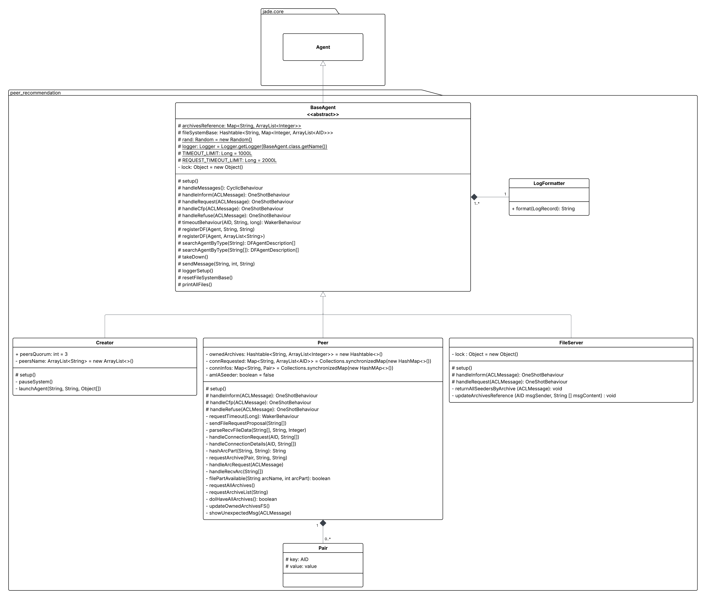

# SMA-P2P-PIBIC

Repositório voltado ao desenvolvimento do Projeto de Iniciação Científica (PIBIC) no período 2024-2025.

## Autores

| **Identificação** | **Nome** | **Formação** |
| :-: | :-: | :-: |
|  | André Corrêa da Silva | Graduando em Engenharia de Software (FCTE/UnB) |
|  | Gabriel Mariano da Silva | Engenheiro de Software (FCTE/UnB) |

*Tabela 1: Identificação dos Autores*

## Métricas do *Building Block*

Lorem ipsum dolor sit amet, consectetur adipiscing elit. Duis congue nisl ac sem egestas, a sodales neque pretium. Nullam dapibus tristique augue in volutpat. Nunc efficitur dolor arcu, quis tempus ipsum elementum vitae. Vestibulum enim risus, cursus quis erat vitae, fermentum elementum quam. Nullam imperdiet faucibus volutpat. Ut in tortor sed justo laoreet commodo ut a dui. Morbi vitae nunc id dolor tristique tincidunt. Donec non est accumsan, bibendum est sed, pharetra felis. Lorem ipsum dolor sit amet, consectetur adipiscing elit. Quisque in nisl id odio ornare efficitur et in dui. Nunc varius tincidunt enim. Vivamus at metus massa. Mauris sodales diam sit amet tempor ullamcorper. Donec vehicula mollis efficitur.

## Descrição

Lorem ipsum dolor sit amet, consectetur adipiscing elit. Duis congue nisl ac sem egestas, a sodales neque pretium. Nullam dapibus tristique augue in volutpat. Nunc efficitur dolor arcu, quis tempus ipsum elementum vitae. Vestibulum enim risus, cursus quis erat vitae, fermentum elementum quam. Nullam imperdiet faucibus volutpat. Ut in tortor sed justo laoreet commodo ut a dui. Morbi vitae nunc id dolor tristique tincidunt. Donec non est accumsan, bibendum est sed, pharetra felis. Lorem ipsum dolor sit amet, consectetur adipiscing elit. Quisque in nisl id odio ornare efficitur et in dui. Nunc varius tincidunt enim. Vivamus at metus massa. Mauris sodales diam sit amet tempor ullamcorper. Donec vehicula mollis efficitur.

## Diagramação

Abaixo, é apresentado o Diagrama de Classes que visa representar a estrutura e organização das classes que compõem o sistema, para além das relações entre estas.



*Figura 1: Diagrama de Classes da Aplicação*

Já abaixo, é apresentado o Diagrama de Sequências, o qual busca apresentar os fluxos de interação e algumas de suas nuances entre todas as classes (instanciadas enquanto agentes) da aplicação desenvolvida.


*Figura 2: Diagrama de Sequências da Aplicação*

## Projeto em Execução

Lorem ipsum dolor sit amet, consectetur adipiscing elit. Duis congue nisl ac sem egestas, a sodales neque pretium. Nullam dapibus tristique augue in volutpat. Nunc efficitur dolor arcu, quis tempus ipsum elementum vitae. Vestibulum enim risus, cursus quis erat vitae, fermentum elementum quam. Nullam imperdiet faucibus volutpat. Ut in tortor sed justo laoreet commodo ut a dui. Morbi vitae nunc id dolor tristique tincidunt. Donec non est accumsan, bibendum est sed, pharetra felis. Lorem ipsum dolor sit amet, consectetur adipiscing elit. Quisque in nisl id odio ornare efficitur et in dui. Nunc varius tincidunt enim. Vivamus at metus massa. Mauris sodales diam sit amet tempor ullamcorper. Donec vehicula mollis efficitur.

## Requisitos Técnicos

Lorem ipsum dolor sit amet, consectetur adipiscing elit. Duis congue nisl ac sem egestas, a sodales neque pretium. Nullam dapibus tristique augue in volutpat. Nunc efficitur dolor arcu, quis tempus ipsum elementum vitae. Vestibulum enim risus, cursus quis erat vitae, fermentum elementum quam. Nullam imperdiet faucibus volutpat. Ut in tortor sed justo laoreet commodo ut a dui. Morbi vitae nunc id dolor tristique tincidunt. Donec non est accumsan, bibendum est sed, pharetra felis. Lorem ipsum dolor sit amet, consectetur adipiscing elit. Quisque in nisl id odio ornare efficitur et in dui. Nunc varius tincidunt enim. Vivamus at metus massa. Mauris sodales diam sit amet tempor ullamcorper. Donec vehicula mollis efficitur.

## Requisitos para Execução

Para a efetiva execução do *building block* disposto no repositório, se faz necessária a instalação e configuração do *software* *Maven* em sua máquina. Para tal, basta seguir as instruções de instalação dispostas na [**documentação do *Maven***](https://maven.apache.org/install.html). Para o desenvolvimento do *building block*, foi utilizado o *Maven* na versão **3.8.7**. Além disso, todas as instruções de execução consideram o uso de sistemas operacionais baseados em *Linux*.

## Como Executar?

Para a execução do *building block*, é possível utilizar-se do *Makefile* adicionado ao repositório ao seguir os seguintes passos:

- Primeiramente, clone o repositório em sua máquina:

```bash
git clone https://github.com/gabrielm2q/SMA-P2P-PIBIC.git
```

- Em seguida, vá para a pasta do repositório:

```bash
cd SMA-P2P-PIBIC
```

- Para realizar a *build* do projeto e executá-lo em seguida, execute o seguinte comando:

```bash
make build-and-run
```

> 🚨 **IMPORTANTE:** Ao executar o projeto, primeiro será realizada a criação de todos os agentes participantes. Logo após, para a efetiva realização do propósito desejado pelo *building block*, é necessário pressionar **ENTER** no terminal para a continuidade da execução do código. Esta decisão foi tomada em prol de uma facilitação do uso do *sniffer* para a visualização da comunicação entre os agentes participantes.

- É possível realizar apenas a *build* do projeto com o seguinte comando:

```bash
make build
```

- Similarmente, é possível rodar o projeto após a geração de sua build com o seguinte comando:

```bash
make run
```

- É possível alterar a quantidade de agentes participantes ao passar a variável **QUORUM** seguida do número desejado, como pode ser visto abaixo (onde N representa o número desejado de agentes):

```bash
make build-and-run QUORUM=N"
```

- Por fim, para apagar os arquivos derivados da *build* do projeto, execute o seguinte comando:

```bash
make clean
```

- Para ter acesso a uma série de informações úteis para a execução do building block, basta executar o seguinte comando:

```bash
make help
```

## Referências

[*Sistemas Multiagentes e Sistemas de Tomada de Decisão: Uma Visão Orientada à Building Blocks*](https://github.com/SMA-building-blocks). <br />
[*Jade Project*](https://jade-project.gitlab.io/). <br />
[*Maven*](https://maven.apache.org/).
